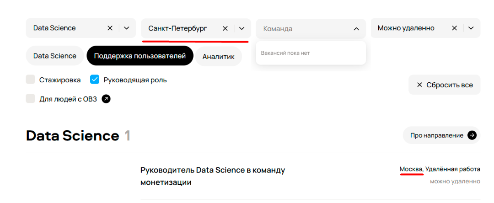
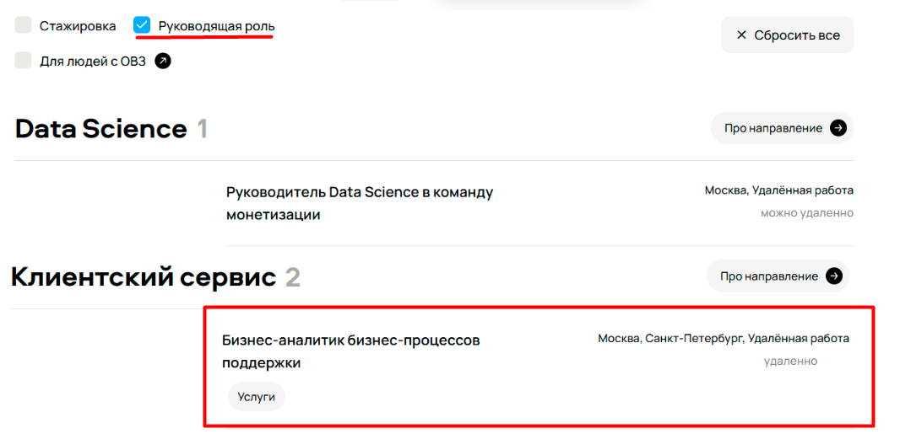
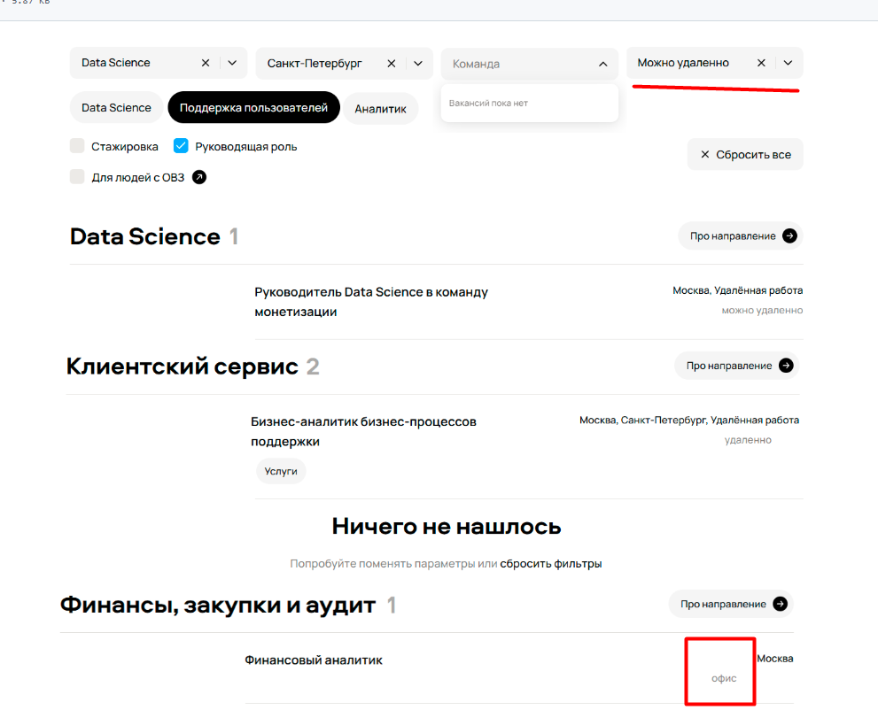
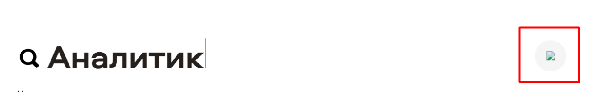
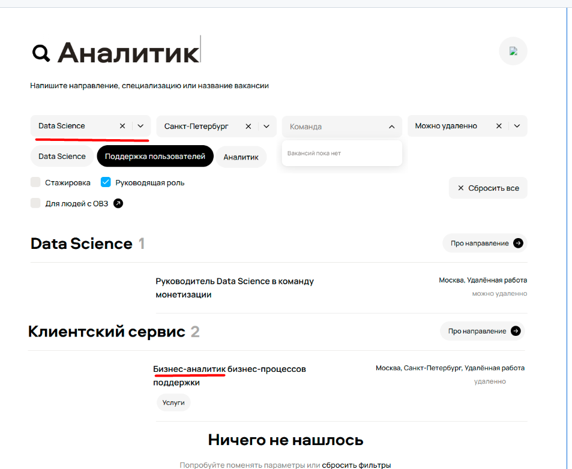
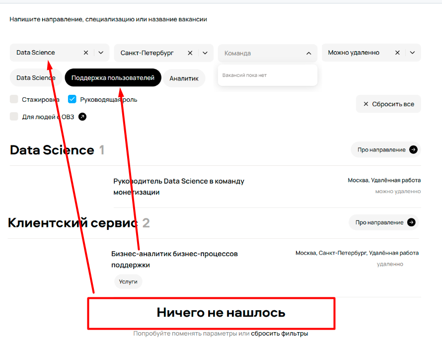
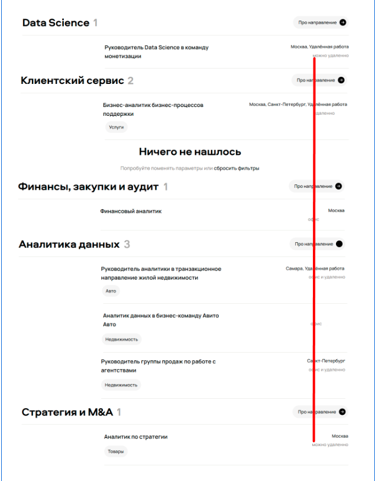
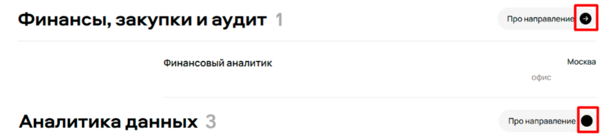

# **Задание 1. Поиск багов**

## Найденные баги:

### 1. Некорректная работа фильтра по полю "Город"
- **Приоритет:** High
- **Описание:**  При активном фильтре "Санкт-Петербург" в результатах поиска отображаются вакансии из всех городов.
- **Скриншот:** 
- **Объяснение:** 1) Кандидат может не заметить некорректную работу фильтрации и откликуться, тогда Авито потратит ресурсы на изучение кандидата, который при получении офера может отказаться из-за несоответствующей для него локации. 2) Нарушение доверия: пользователь перестаёт полагаться на фильтры всех страниц компании.

### 2. Некорректная работа чекбокса в фильтре
- **Приоритет:** High
- **Описание:** При включённом чекбоксе "Руководящая роль" отображаются вакансии всех уровней, включая не руководящие позиции.
- **Скриншот:** 
- **Объяснение:** Кандидат видит вакансии на все позиции при явном запросе на руководящие - риск ухода с платформы и потери потенциального топ-сотрудника.

### 3. Некорректная работа фильтра по полю "Формат работы"
- **Приоритет:** High
- **Описание:** При активном фильтре "Можно удаленно" в результатах поиска, в том числе отображаются вакансии только с офисным форматом работы.
- **Скриншот:** 
- **Объяснение:** Прямая ложь пользователю - включил удаленку, получает вакансии из офиса.

### 4. Не прогружается иконка в поле ввода
- **Приоритет:** Medium
- **Описание:** В поле поиска вакансий не прогружается иконка. Вместо иконки отображается только .
- **Скриншот:** 
- **Объяснение:** Поле поиска - главная функциональность данной страницы, поэтому непрогруженная иконка заметна и выглядит непрофессионально, но она не влияет на результат поиска.

### 5. Несоответствие фильтра "Data Science" и результатов
- **Приоритет:** High
- **Описание:** При активном фильтре "Data Science" в результатах поиска отображаются вакансии других направлений.
- **Скриншот:** 
- **Объяснение:** Затрагивает всех пользователей, использующих фильтр - основной сценарий поиска.

### 6. Предложенные специализации не соответствуют выбранному направлению.
- **Приоритет:** High
- **Описание:** Поддержка пользователей относится к клиентскому сервису - не к Data Science.
- **Скриншот:** 
- **Объяснение:** _Считаю, что из-за этой ошибки в разделе "Клиентский сервис" вышло противоречивое сообщение "Ничего не нашлось"(результат вывелся для фильтра "Поддержка пользователей", а для Data Science не нашел подходящего рез-та. Данный баг описывать не буду. Надо изначально исправить баг №6 и уже после проверить отстутствие противоречивого сообщения "Ничего не нашлось")_

### 7. Орфографическая ошибка в футере: "Telagram" вместо "Telegram"
- **Приоритет:** Medium
- **Описание:** В футере сайта присутствует орфографическая ошибка в названии мессенджера: "Telagram" вместо корректного "Telegram".
- **Скриншот:**  

- **Объяснение:** Репутация важна, но функция не сломана.

### 8. Некорректное выравнивание элементов в списке вакансий
- **Приоритет:** Low
- **Описание:** В списке вакансий правая часть контента (локация, формат работы) имеет неправильное выравнивание. Элементы смещены относительно основной структуры страницы, что нарушает визуальную целостность интерфейса.
- **Скриншот:**  

- **Объяснение:** Косметическая ошибка.

### 10. Несогласованное состояние кнопки "Про направление"
- **Приоритет:** Low
- **Описание:** Кнопка "Про направление" в блоке "Финансы, закупки и аудит" отличается выполняющей тот же функционл в других блоках.
- **Скриншот:** 
- **Объяснение:** _(Будем считать, что функциональность кнопок полностью сохранена)_. Косметическая ошибка.